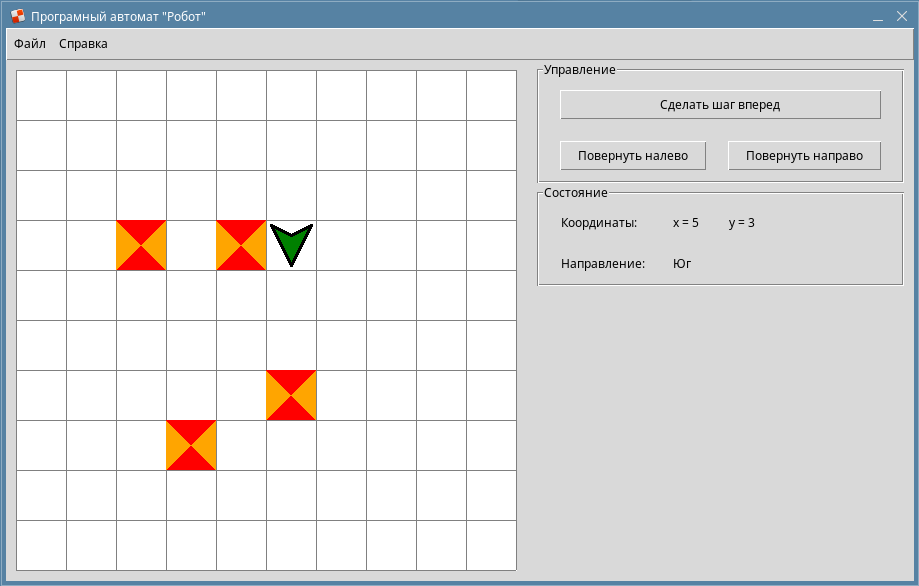

# Программный автомат
## Внешни вид программы

## Описание программы 
Данная программа представляет собой имитацию работы программного автомата 
робота, движущегося по игровому полю. Для робота задаются команды: 
«повернуть налево», «повернуть направо», «сделать один шаг вперед». 
После получения команды автомат отображает значение координаты игрового поля, 
которого достигает робот после выполнения команды, либо выдает сообщение, 
если невозможно выполнить данную команду (робот встретил на своем пути 
препятствие или достиг края игрового поля). Для представления 
«долговременной памяти» автомата использовать текстовый файл. 
Программа должна запускаться в трех режимах работы: 
1. режим конфигурирования, позволяющий задавать параметры моделируемой системы; 
2. режим редактирования конфигурации, позволяющий изменять параметры 
моделируемой системы; 
3. рабочий режим, моделирующий работу конечного 
автомата. 
Запуск программы сопровождается вводом имени пользователя и 
соответствующего ему пароля. Вся конфигурационная информация для конечного 
автомата должна записываться в текстовый файл - долговременную, 
энергонезависимую память. Для хранения пароля и обеспечения целостности 
данных в файлах конфигурации использовать шифрование данных.